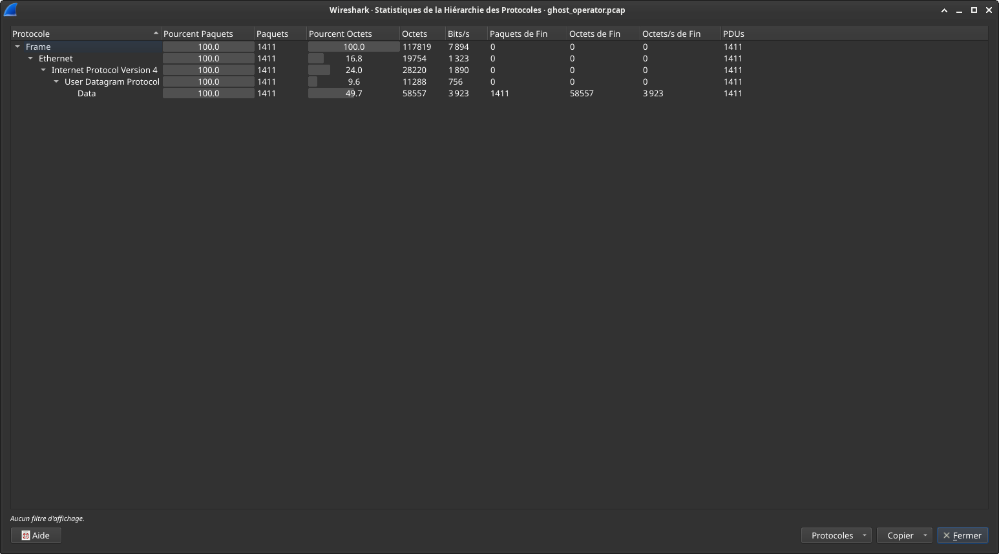
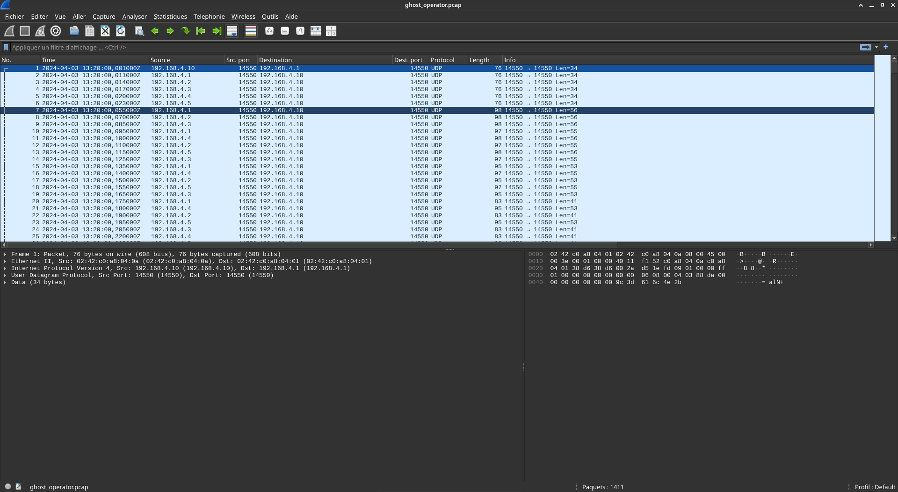
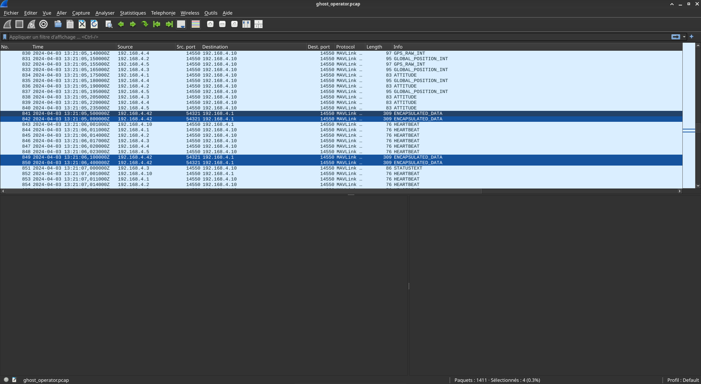
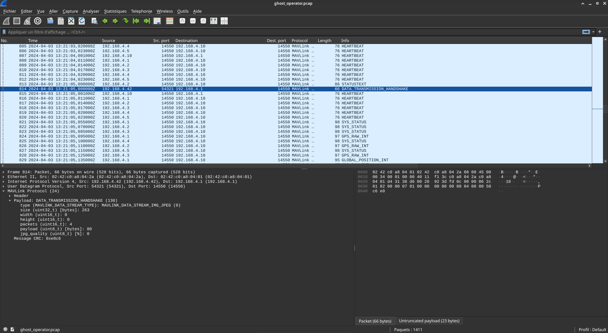
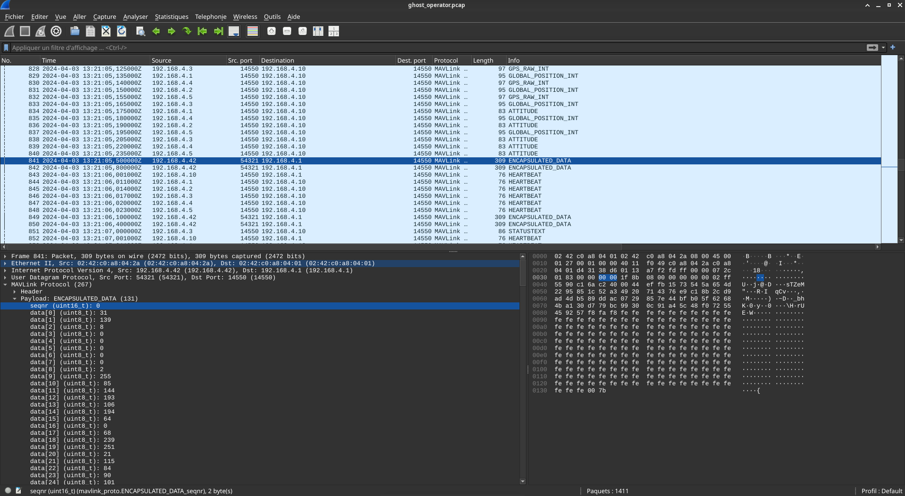
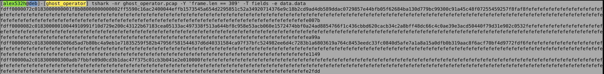

# Ghost Operator

## Enoncé

Breizh Aero Survey opère une flotte de 5 drones de cartographie (ALPHA, BRAVO, CHARLIE, DELTA, ECHO) le long de la côte bretonne. Les appareils communiquent avec la station sol via un protocole standard de télémétrie aéronautique.

Ce matin, pendant un vol de routine, un des drones a cessé de répondre aux commandes et a quitté sa trajectoire pour se diriger vers une zone isolée. L'équipe réseau avait un tcpdump actif sur le lien drone/sol pendant l'incident.

L'analyse préliminaire révèle un acteur réseau non identifié qui a échangé des messages avec la flotte. Le SOC suspecte une prise de contrôle suivie d'une exfiltration de données.

Votre mission :
- Retrouvez ce que l'attaquant a extrait

## Analyse

Après avoir vérifié le checksum du fichier, on peut commencer l'analyse :

```bash
echo '2a7a8f96a4dfb86b79eb975877b8fa37 ghost_operator.pcap' | md5sum -c -
ghost_operator.pcap: Réussi
```

Premier réflexe que j'ai quand j'analyse une capture réseau, c'est de regarder quels sont les protocols utilisés. Ici, nous n'avons que de l'udp.



Il faut toutefois se souvenir dans l'énoncé que *"les appareils communiquent avec la station sol via un protocole standard de télémétrie aéronautique"*. J'ai regardé rapidement le port utilisé et fait une recherche internet `protocol udp 14550`.  
On tombe sur [portlookup](https://portlookup.com/port-14550/) qui nous apprend que c'est du MAVLink.



Ensuite j'ai cherché à parser le traffic avec wireshark en lui précisant d'utiliser MAVLink.  
J'ai suivi la [procédure](https://mavlink.io/en/guide/wireshark.html) pour parser du MAVLink dans wireshark.

En analysant le traffic ainsi parsé on tombe sur 4 packets ayant pour description `ENCAPSULATED_DATA`.



Ces packets contiennent surement nos données exfiltrées !

D'ailleur, le packet précédent (pour le drone en question), contient la demande de stream (précisant le nombre de packet nécessaire au transfert de données).



Comme je suis teubé, je n'ai pas réussi à récupérer la donnée **intégrale** depuis l'interface de wireshark qui la présente sous forme d'une liste de bytes (et j'avais la flemme de faire les valeurs une à une), j'ai décidé de le faire avec tshark.



Après avoir vérifié que seuls ces packets avaient une taille de 309 octets avec

```
frame.len == 309
```

J'ai donc extrait les données brutes avec tshark

```bash
tshark -nr ghost_operator.pcap -Y 'frame.len == 309' -T fields -e data.data
```

>PS : il faut enlevé le plugin précédemment mis sinon ça ne fonctionne pas. Je n'ai pas cherché pourquoi.

J'ai vite remarqué un pattern à la fin de la donnée (`fefe...`).
De plus, en se souvenant du parsing dans wireshark et en skippant le seqnr, la première valeure qu'on cherche est `1f` (qui est après les 24 premiers caractères hexa). Puis il nous reste à enlever le padding et le CRC du message en skippant les 350 derniers caractères hexa.



```bash
tshark -nr ghost_operator.pcap -Y 'frame.len == 309' -T fields -e data.data | sed -E 's/^([0-9a-f]{24})([0-9a-f]+)([0-9a-f]{350})/\2/' | tr -d '\n' | sed -E 's/^([0-9a-f]+)([e-f]{114})$/\1/' | xxd -r -p > data.bin
```

Un file dessus nous apprend qu'il s'agit d'un fichier gz.

```bash
file data.bin 
data.bin: gzip compressed data, max compression, original size modulo 2^32 302
```

D'où la solution finale.

## Solution

```bash
tshark -nr ghost_operator.pcap -Y 'frame.len == 309' -T fields -e data.data | sed -E 's/^([0-9a-f]{24})([0-9a-f]+)([0-9a-f]{350})/\2/' | tr -d '\n' | sed -E 's/^([0-9a-f]+)([e-f]{114})$/\1/' | xxd -r -p | gunzip > flag
```

```
=== GHOST OPERATOR — MISSION LOG ===
Date: 2024-04-03T12:00:00Z
Operator: GH0ST_0P3R4T0R
Target: Drone ALPHA (sysid 1)
Method: MAVLink GCS Identity Spoof + Param Hijack
Redirect: 48.0375, -4.8503 (Ile de Sein)
Status: Target acquired and redirected
Flag: BZHCTF{ALPHA_GH0ST_0P3R4T0R}
=== END LOG ===
```

```
BZHCTF{ALPHA_GH0ST_0P3R4T0R}  
```